# Zusammenbau der Hardware

1. Alle Bauteile

* BME 280 mit Stiftleiste
*  Baseplate
*  WIFI LoRa 32 (V2) mit Stiftleisten
*  Pigtail
*  Antenne
*  LED
*  2x Unterlegscheiben M2
*  2x Schrauben M2 8 mm
*  1x Mutter M3
*  1x Schraube M3 8 mm
*  6x Jumper Kabel Female-Female

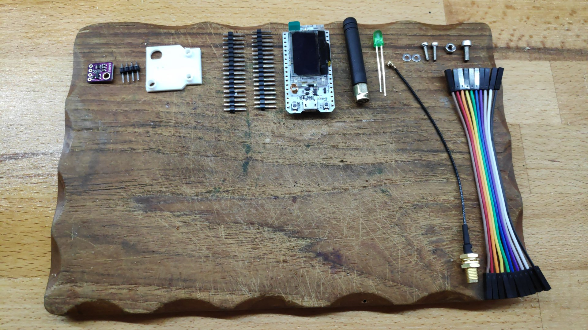

2. Beide Stifleisten an WIFI LoRa 32 (V2) anlöten.

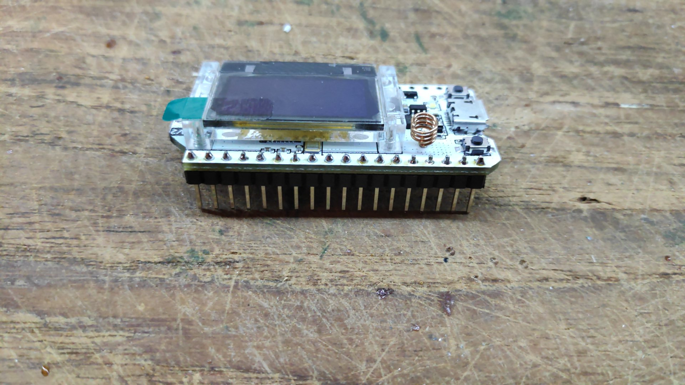

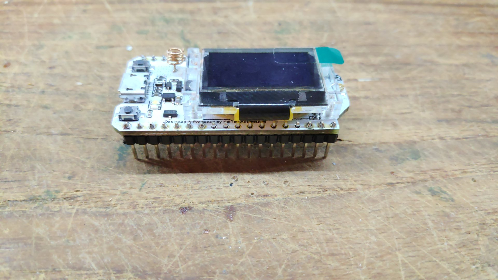

3. Zwei Schrauben für Displayhalterung entfernen.

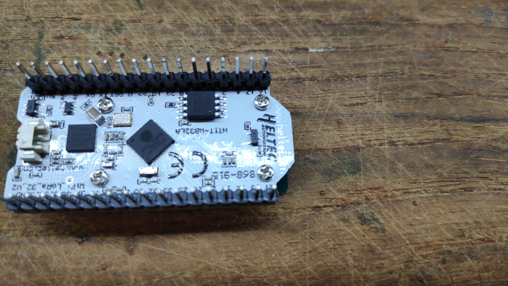

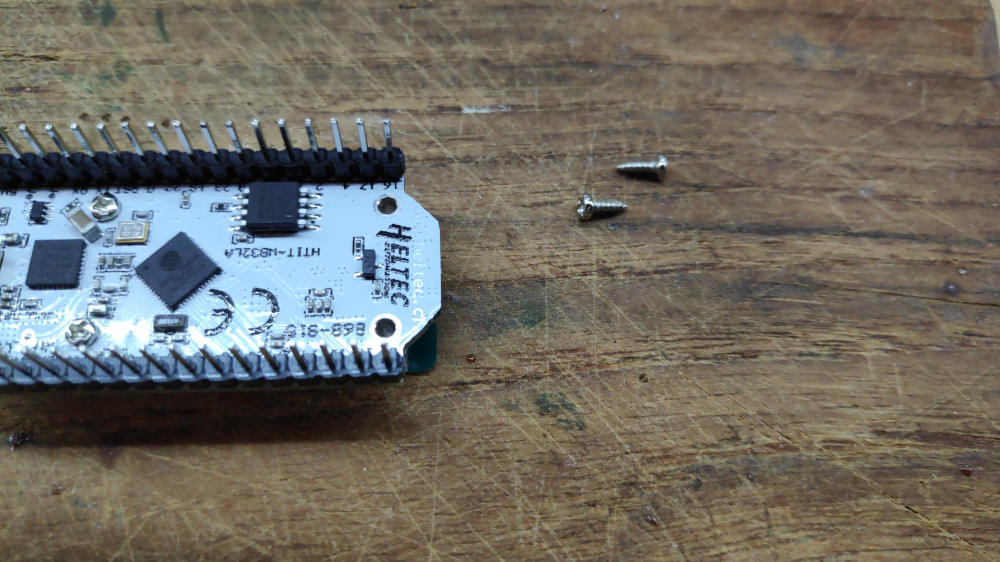

4. Baseplate mit M2 Schrauben und Unterlegscheiben fixieren. 

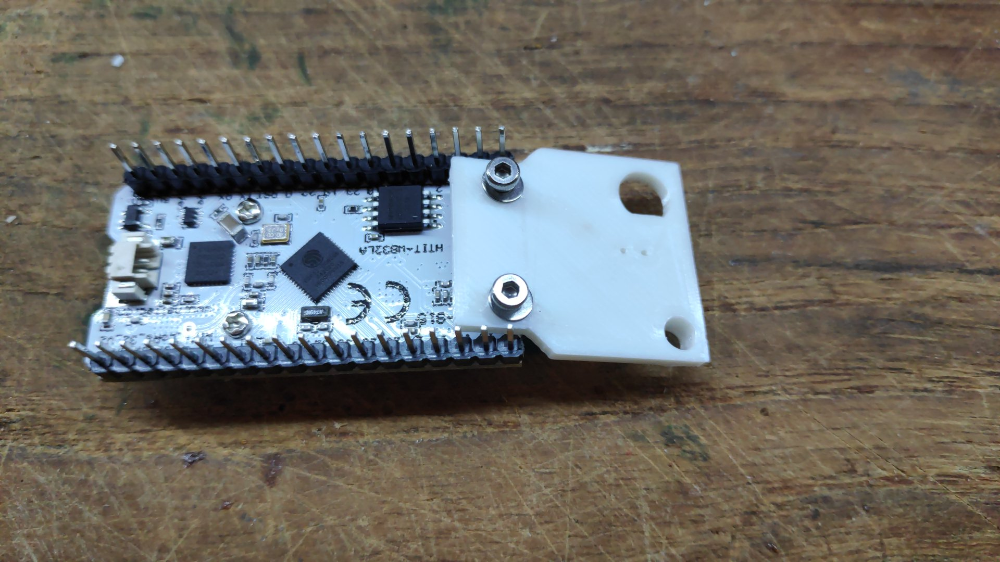

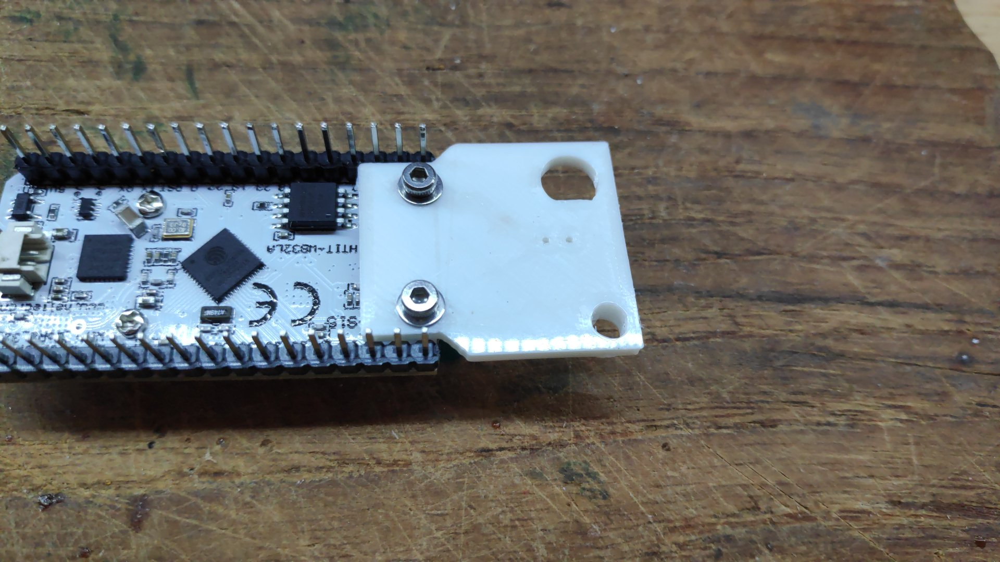

5. Stiftleiste an BME 280 anlöten.

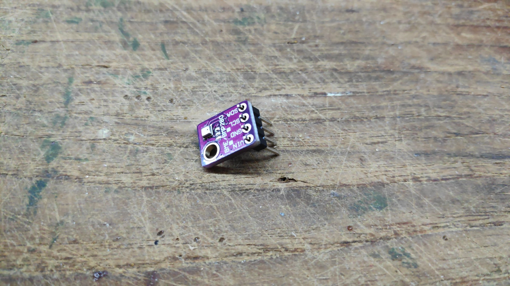

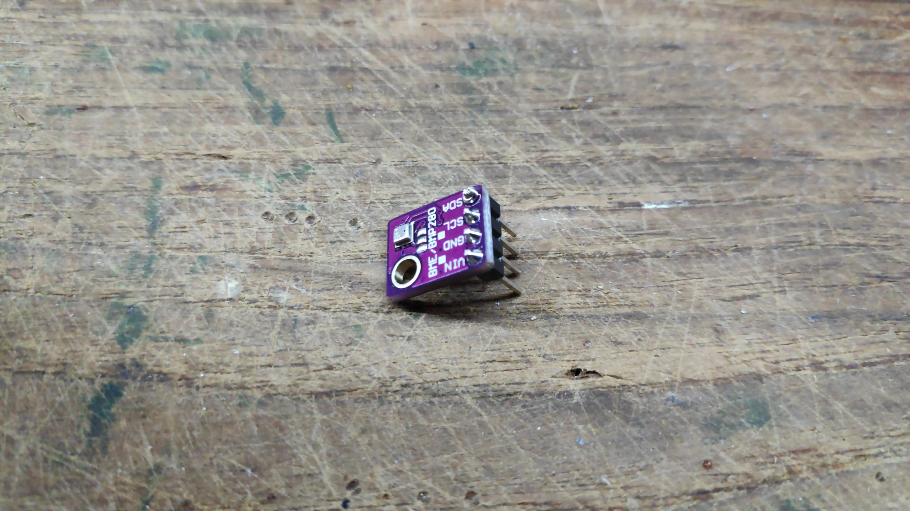

6. BME 280 mit M3 Schraube und Mutter fixieren.

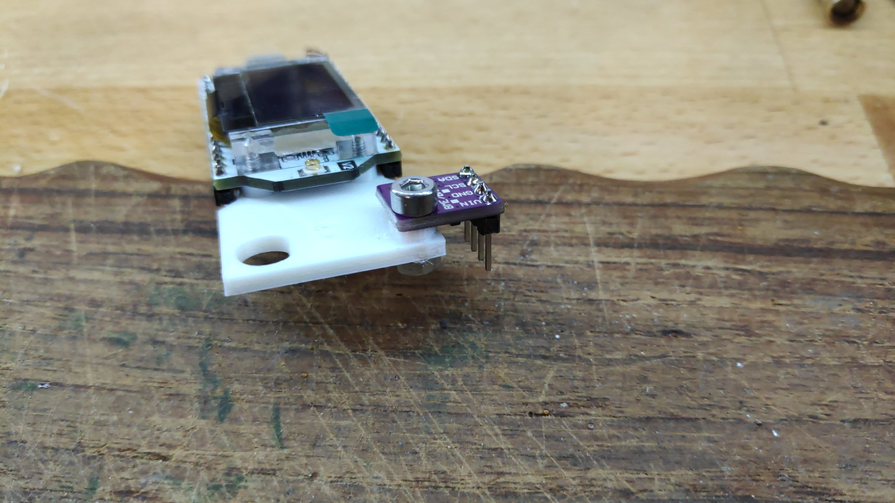

7. Pigtail an Baseplate festschrauben.

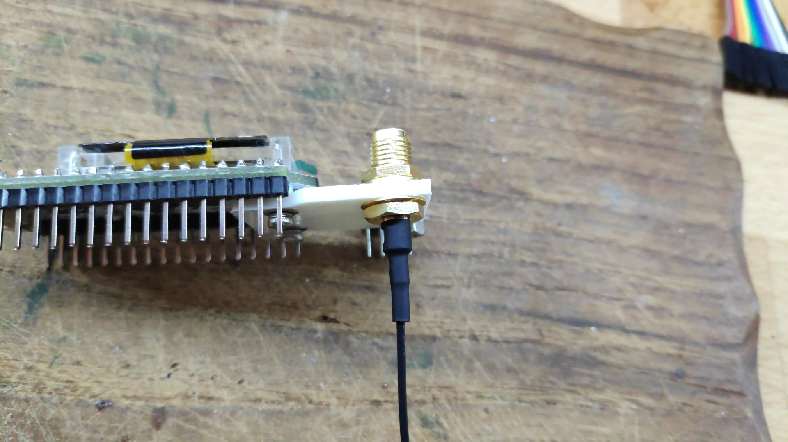

8. LED in Baseplate einstecken.

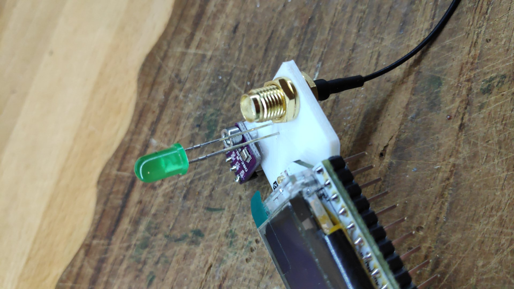

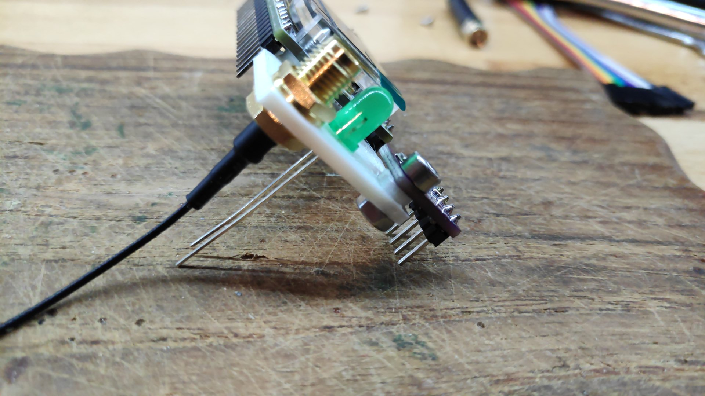

9. Pigtail an U.FL Stecker anschließen.

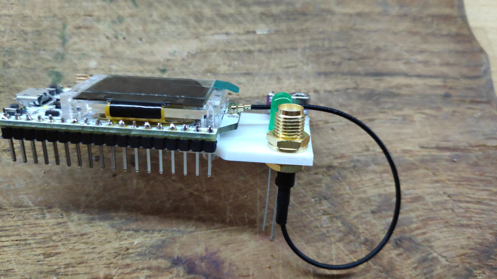

10. Mit Jumper Kabel LED verbinden

WIFI LoRa 32 (V2) | LED | Vorzugsfarbe
-------- | -------- | --------
Pin 17   | Anode (langer Pin)   | Orange
GND   | Kathode (kurzer Pin)   | Braun

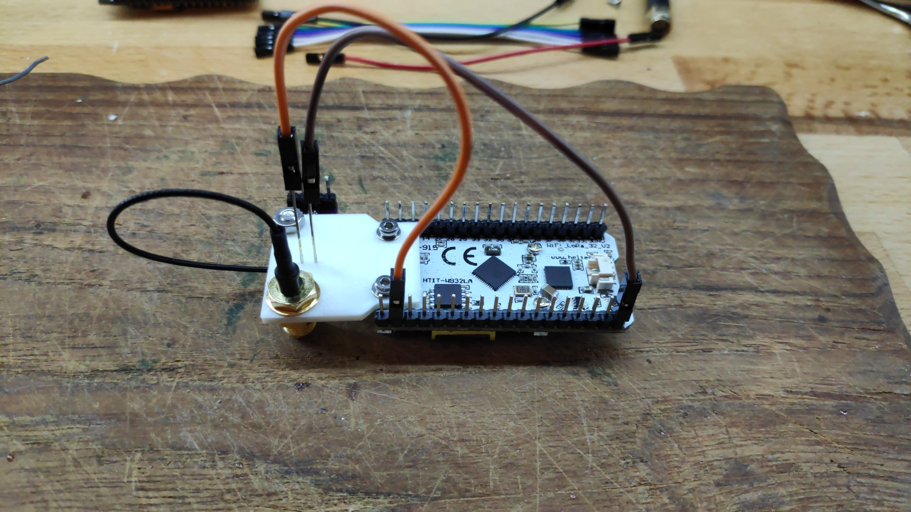

11. Mit Jumper Kabel BME 280 verbinden

WIFI LoRa 32 (V2) | BME280 | Vorzugsfarbe
-------- | -------- | --------
Pin 21   | SDA   | Blau
Pin 22   | SCL   | Gelb
3V3   | VIN   | Rot
GND   | GND   | Schwarz

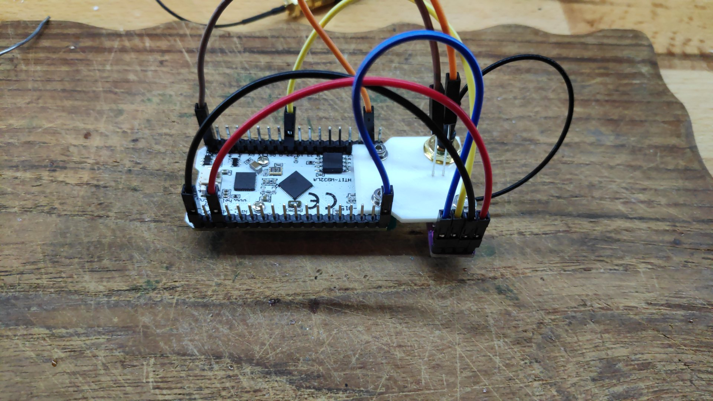

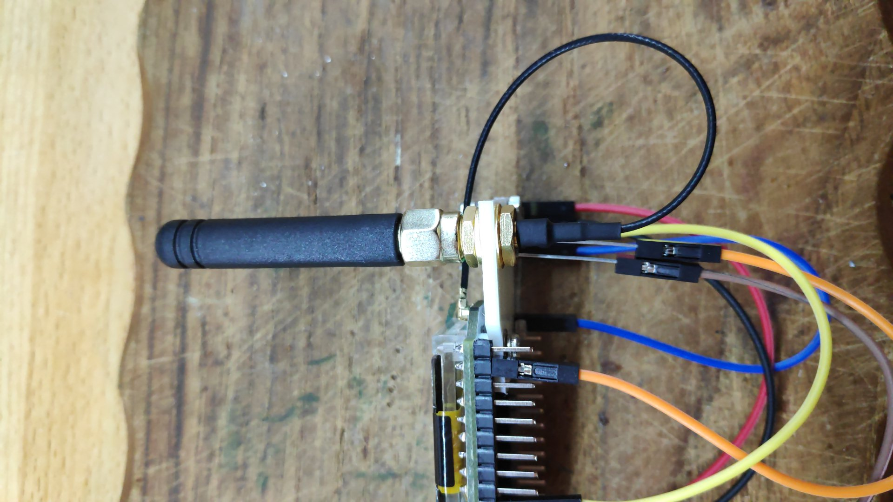
 
