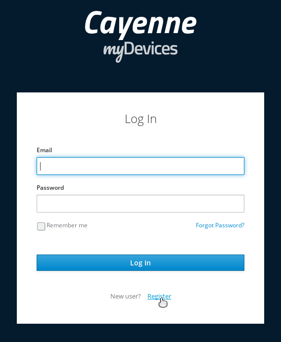
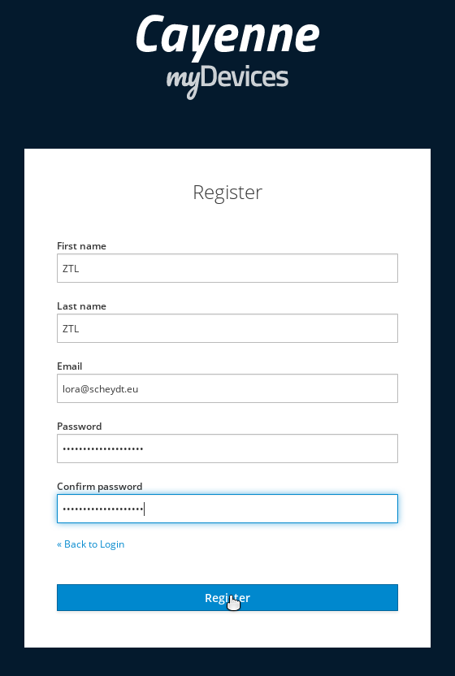
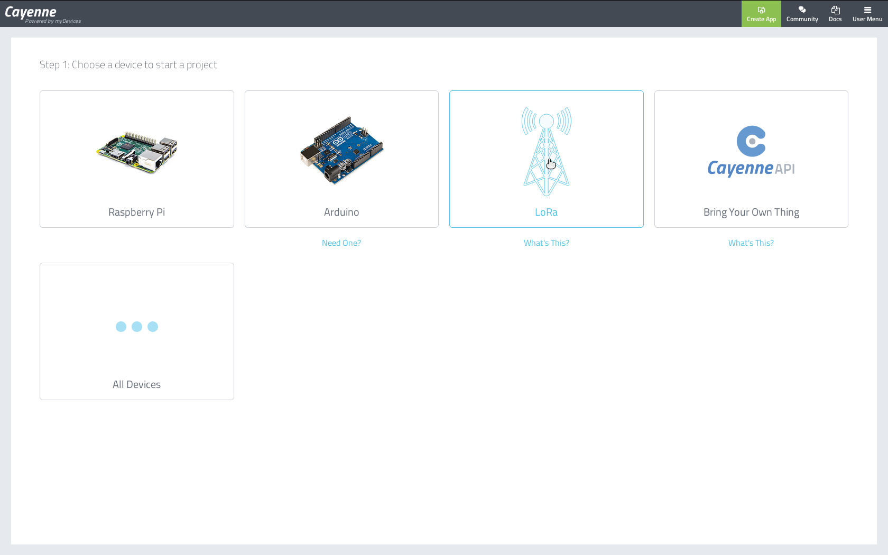
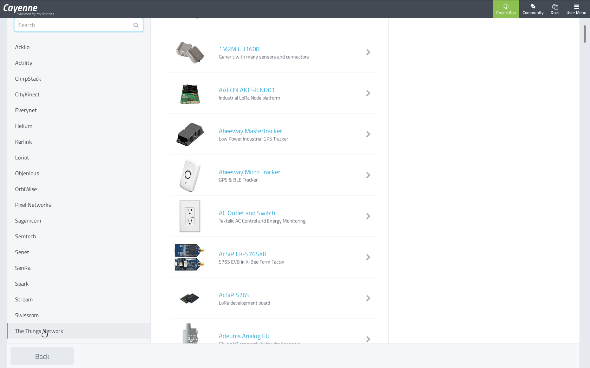
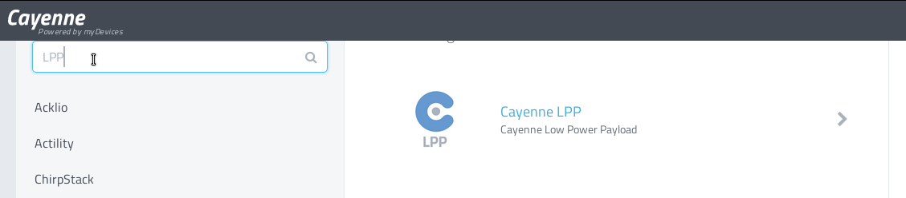
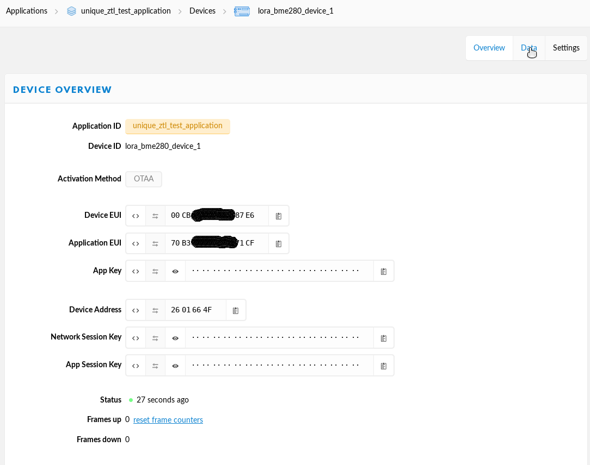
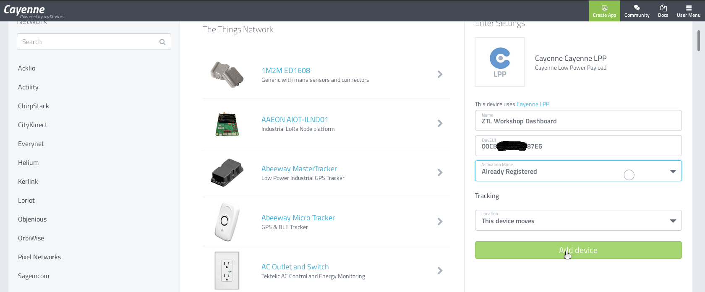
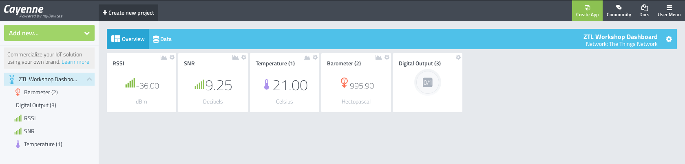

# myDevices Cayenne Dashboard
[Cayenne Dashboard](https://cayenne.mydevices.com/)

1. Register

2. Vorname, Nachmane, Email-Adresse und Passwort vergeben. Mit Register bestätigen:

3. LoRA auswählen

4. In der Liste links "The Thingnetwork" auswählen:

5. Dann nach "LPP" suchen und "Cayenne LPP" auswählen:

6. Aus dem TTN die Device EUI in hex format kopieren.

7. Name vergeben, die soeben kopierte Device EUI einfügen und Already Registered auswählen. Mit "Add device" bestätigen.

8. Sobald die ersten Daten empfangen werden, baut sich das Dashboard von selbst auf:

Mit einem Klick auf Digital Output kann die LED am Sensor aktiviert werden. Diese Information wird jedoch erst zum Sensor übertragen, nachdem dieser Seinerseits Daten übertragen hat.