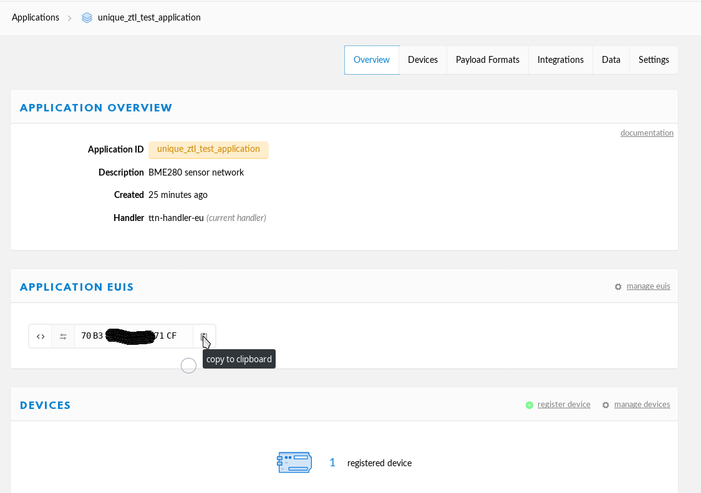

# myDevices Cayenne Dashboard
[Cayenne Dashboard](https://cayenne.mydevices.com/)
1. Register

2. Vorname, Nachmane, Email-Adresse und Passwort vergeben. Mit Register bestätigen:

3. LoRA auswählen

4. In der Liste links "The Thingnetwork" auswählen:

5. Dann nach "LPP" suchen und "Cayenne LPP" auswählen:

6. Name vergeben, Device EUI in hex aus dem TTN kopieren und Already Registered auswählen. Mit "Add device" bestätigen.

7. Sobald die ersten Daten empfangen werden, baut sich das Dashboard von selbst auf:
