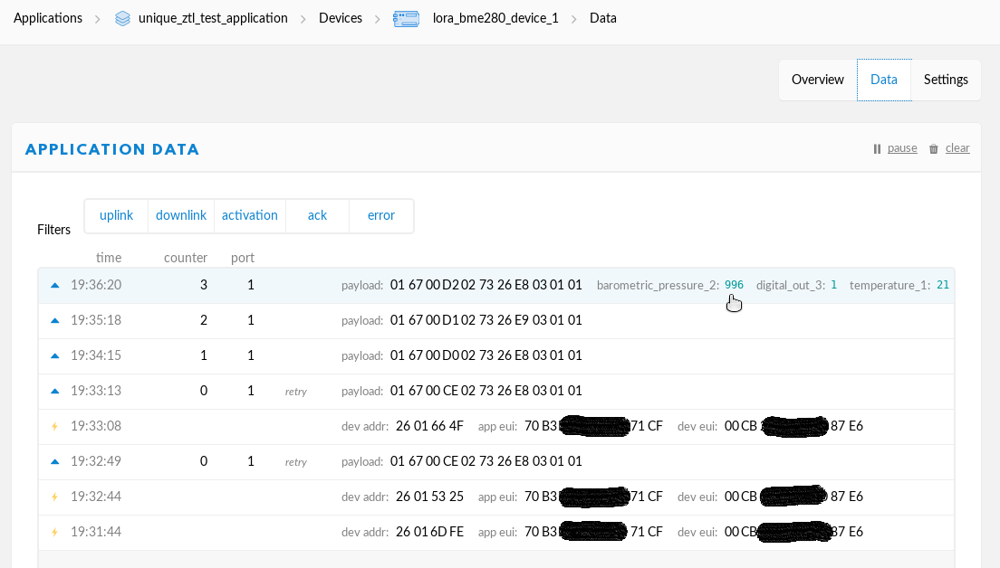

# The Thing Network (TTN)

1. "Sign Up"

2. Nutzername, Email-Adresse und Passwort eingeben. Mit "Create account" bestätigen

3. Ist der Account angelegt, muss man auf die Bestätigungsmail warten.

4. Im Email-Postfach "Activate account" klicken.

5. Den Reiter "Console" auswählen.

6. "Applications" auswählen.

7. Mit "Get started by adding one!" oder "+ add application" eine Application anlegen.

8. Application ID und Description vergeben und mit "Add application" bestätigen.

9. "+ register device" auswählen.

10. Device ID vergeben und mit "Register" bestätigen.

11. Die nun angezeigten Daten müssen in die Sensorfirmware übernommen werden. Dazu mit "<>" C-Style auswählen und Device EUI und Application EUI auf "lsb" einstellen. Der App Key bleibt bei "msb". Mit dem Button ganz rechts können die EUIs und der Key in die Zwischenablage kopiert werden.

12. In der Firmware die drei Daten in die Datei "defines.h" kopieren.

13. Mit dem "->" Pfeil Symbol wird die Firmware compiliert und auf den ESP32 geflashed.

14. Wenn man auf das Stecker-Symbol klickt, werden die Debug-Ausgaben angezeigt. Der Text "Packet queued" ist ein gutes Zeichen, dass der Sensor seine Daten verschickt hat.

15. Zurück im TTN sollte der Status auf Grün gewechselt haben. Die übertragenen Daten lassen sich unter dem Reiter "Data" einsehen.

16. Hier solle jede Minute eine neue Zeile erscheinen. Nun wird die Datenweitergabe an das Cayenne Dashboard vorbereitet. Dazu muss auf Application->Application ID geklickt werden.

17. "Payload Formats" auswählen.

18. "Cayenne LPP" auswählen.

19. Mit "Save" bestätigen.

20. Unter Applications->Application ID->Devices->Device ID->Data sieht man nun im Payload die interpretierten Werte.

21. Unter Applications->Application ID->Integrations "+ add integration" klicken.

22. "myDevices" auswählen.

23. Process ID vergeben, default key wählen und mit "Add integration" bestätigen.

Weiter gehts unter: [Cayenne](Cayenne.md).

